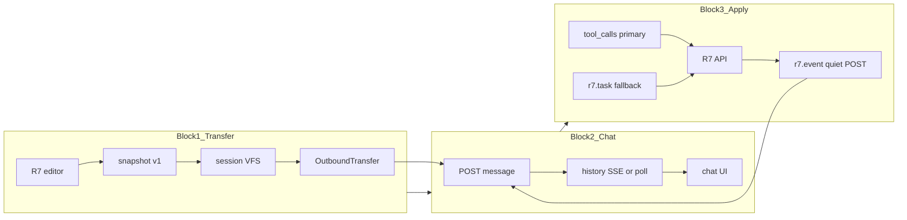

# Архитектура ladcraft-r7_new (LCA)

Форк [`ladcraft-r7_btn_stream`](../ladcraft-r7_btn_stream/) с контрактом **tool_calls-first** и feedback **`r7.event`**.



## Контракт между блоками

**Блок 1 → 2:** `OutboundTransfer` (`src/transfer/types.ts`)

**Блок 2 → 3:** `HistoryMessage` с `tool_calls` + text (fence fallback)

**Блок 3 → 2:** quiet `sendMessage` с ```r7.event``` (без snapshot remount, без optimistic user bubble)

## Каталоги

| Блок | Путь | Документация |
|------|------|--------------|
| 1 | `src/transfer/` | [01-transfer-rules.md](01-transfer-rules.md) |
| 2 | `src/main.ts`, `src/ui/`, `src/eai/` | [02-chat-rules.md](02-chat-rules.md) |
| 3 | `src/apply/` | [03-apply-rules.md](03-apply-rules.md), [04-skill-output-contract.md](04-skill-output-contract.md) |

## Агент

Целевой агент: [`cases/LCA/`](../../LCA/) (лингвистическая проверка).
