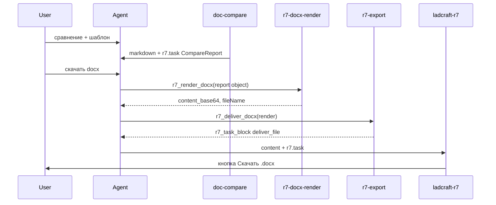

# Handoff: сценарий A — DOCX через сервер (skills Ladcraft + плагин R7)

Документ для **проекта навыков Ladcraft**. Плагин `plugins/ladcraft-r7` дорабатывается под этот контракт в репозитории Macros.

Связано: [ladcraft-r7-doc-compare-skill-handoff.md](ladcraft-r7-doc-compare-skill-handoff.md), [ladcraft-r7-export-skill-spec.md](ladcraft-r7-export-skill-spec.md), [ladcraft-r7-docx-render-skill-spec.md](ladcraft-r7-docx-render-skill-spec.md), [ladcraft-r7-compare-agent-orchestration.md](ladcraft-r7-compare-agent-orchestration.md).

---

## 1. Цель

Пользователь после сравнения документов пишет в чат R7 **«скачать docx»** / **«сохрани в Word»** → агент собирает `.docx` на сервере → в ответе assistant-сообщения блок `r7.task` с `deliver_file` → плагин показывает кнопку **«Скачать .docx»** и скачивает бинарник из session VFS.

Плагин **не** строит DOCX на клиенте. Fallback `.md` / `.html` остаётся для локального скачивания без агента.



---

## 2. Навык `doc-compare` — обязательные правки

**Файл на сервере:** skill `doc-compare` (в репо: `knowledge-base/skills Ladkraft/doc_compare_v1/SKILL.md`).

### 2.1. Удалить / заменить

| Найти | Действие |
|-------|----------|
| `не возвращай r7.task` | **Удалить.** После сравнения `r7.task` **обязателен** (§2.3). |
| «JSON только в tool result» как единственный канал | **Дополнить:** JSON также в скрытом `r7.task`; tool result оставить для `r7_render_docx`. |
| Подсказка «скачать — .md/.html» | **Заменить:** «**скачать** — .md/.html в плагине; **скачать docx** / **сохрани в Word** — отчёт Word через агента». |

### 2.2. Frontmatter

```yaml
description: Сравнивает документ R7 с эталоном Templates. Чат — markdown; CompareReport (doc-compare/v1) — в tool result и скрытом r7.task для плагина R7 и Word.
```

### 2.3. Раздел «Выход после сравнения» (добавить)

После сравнения **три обязательных артефакта** в одном assistant-сообщении:

| # | Канал | Содержимое |
|---|-------|------------|
| 1 | `content` (чат) | Markdown: резюме, таблицы, «**Расхождений: N**», `---`, «Что дальше?» |
| 2 | `result` последнего tool шага сравнения | Объект CompareReport `doc-compare/v1` |
| 3 | Скрытый `r7.task` в конце `content` | `deliver_inline` с JSON-строкой CompareReport |

Шаблон `r7.task` (плагин скрывает блок):

```markdown
```r7.task
[
  {
    "type": "deliver_inline",
    "data": {
      "fileName": "compare-report.json",
      "mimeType": "application/json",
      "encoding": "utf8",
      "content": "<JSON.stringify(CompareReport) в одну строку>",
      "actions": []
    }
  }
]
```
```

Правила:

- `actions: []` — не дублировать export-карточку; кнопки вставки/скачивания md показывает плагин.
- В видимом `content` **запрещены** сырой JSON, блоки ` ```json `, snapshot R7.
- **Не** вызывать `r7-export` на шаге сравнения.

### 2.4. Схема CompareReport (минимум)

```json
{
  "schema": "doc-compare/v1",
  "title": "Сравнение документов",
  "meta": {
    "documentA": { "name": "ТТ_десктоп.md", "role": "эталон" },
    "documentB": { "name": "r7-word_….json", "role": "сравниваемый" },
    "totalDiffs": 5
  },
  "sections": [
    {
      "heading": "1. Общие характеристики",
      "level": 2,
      "tables": [
        {
          "headers": ["Пункт", "Параметр", "Эталон", "Документ", "Тип расхождения"],
          "rows": [["1.1.1.2", "…", "…", "…", "⚠️ критичное"]]
        }
      ],
      "quotes": []
    }
  ],
  "summaryTable": { "headers": ["Категория", "Кол-во"], "rows": [] },
  "risks": [],
  "suggestedFileName": "сравнение_ТТ_десктоп.docx"
}
```

Все секции отчёта (критичные, неточности, сводка) — в `sections`, не только краткая таблица из чата.

---

## 3. Навык `r7-docx-render` — tool `r7_render_docx`

### 3.1. Проблема из smoke (2026-06-26)

Агент вызвал:

```json
{ "report": "{\"schema\":\"doc-compare/v1\",...}" }
```

Tool вернул: `Validation error: data/report must be object`.

### 3.2. Исправить JSON Schema tool

```yaml
# input.schemas.input.properties.report
report:
  type: object
  description: CompareReport doc-compare/v1 (объект, НЕ строка)
  additionalProperties: true
```

**Запретить** `type: string` для `report`. При необходимости добавить `oneOf: [object, string]` с pre-parse на сервере — но предпочтительно только `object`.

### 3.3. Промпт skill (ключевые строки)

```
Вход: CompareReport из doc-compare (schema: doc-compare/v1).

Источник report (приоритет):
1. GET …/history → assistant-сообщение сравнения → r7.task → deliver_inline compare-report.json
2. tool_calls[].result с CompareReport на шаге сравнения
3. НЕ пересобирай из markdown чата

Вызов (ровно 1 tool):
r7_render_docx({ "report": <объект CompareReport> })

report передавай как JSON-ОБЪЕКТ, не JSON.stringify.

Выход tool (обязательные поля для r7-export):
- content_base64 — base64 готового .docx
- fileName — например сравнение_ТТ_десктоп.docx
- mimeType — application/vnd.openxmlformats-officedocument.wordprocessingml.document

НЕ возвращай r7.task — это делает r7-export.
НЕ проверяй файл через bash ls — sandbox и skill VFS разные слои.
```

### 3.4. Сборка DOCX

- `python-docx` в sandbox (предпочтительно для таблиц).
- Сохранение в `/workspace/out/{fileName}` — опционально; **обязателен** `content_base64` в ответе tool.

---

## 4. Навык `r7-export` — tool `r7_deliver_docx`

### 4.1. Проблема из smoke (2026-06-26)

```
r7_deliver_docx({ "localPath": "/workspace/out/compare_….docx" })
→ ok: false, error: "VFS: нет readFile/read."
```

Причина: агент не передал `content_base64` из `r7_render_docx`, а skill VFS не умеет читать `/workspace/out/` напрямую.

### 4.2. MCP capabilities (проверить на Ladcraft)

В `mcp_spec.default_capabilities` skill `r7-export`:

```yaml
required:
  - type: vfs
    scope: session
    operations:
      - upload
```

`readFile` на `$USER` scope **не** заменяет чтение workspace — для DOCX всегда передавать **`content_base64`**.

### 4.3. Промпт / инструкция агенту

Цепочка **ровно 4 tool** (не останавливаться после render):

```
1. skills activate r7-docx-render
2. r7_render_docx({ "report": <объект CompareReport> })
3. skills activate r7-export
4. r7_deliver_docx({ "render": <полный ответ шага 2> })
```

Альтернатива шага 4:

```json
{
  "content_base64": "<из шага 2>",
  "fileName": "<из шага 2>",
  "mimeType": "application/vnd.openxmlformats-officedocument.wordprocessingml.document",
  "actions": ["download"]
}
```

**Запрещено:**

- передавать только `localPath` без `content_base64`;
- bash `python-docx` вместо `r7_render_docx` (если binding есть);
- `curl` / HTTP upload;
- плейсхолдер `<uuid>` в `fileId`.

### 4.4. Ответ агента пользователю

1. Краткий текст: «Отчёт Word готов. Нажмите **Скачать .docx** под этим сообщением» (или пользователь пишет «скачать» — кнопка появится автоматически).
2. Блок **`r7_task_block`** из ответа `r7_deliver_docx` **дословно** в `content`:

```markdown
```r7.task
[{"type":"deliver_file","data":{"fileId":"<uuid>","fileName":"сравнение_ТТ_десктоп.docx","mimeType":"application/vnd.openxmlformats-officedocument.wordprocessingml.document","actions":["download"],"importAs":null}}]
```
```

Если `r7_deliver_docx` вернул `ok: false` — сообщить ошибку; **не** имитировать `deliver_file`.

### 4.5. Скрипт `r7_deliver_docx.js`

Убедиться, что задеплоена версия из репо `knowledge-base/skills Ladkraft/r7-export/scripts/r7_deliver_docx.js` — она принимает `render` / `content_base64` и возвращает `r7_task_block`.

---

## 5. Промпт агента-оркестратора (R7 compare)

Заменить пункты маршрутизации в [ladcraft-r7-compare-agent-orchestration.md](ladcraft-r7-compare-agent-orchestration.md):

```
3. После отчёта сравнения — предложи: «**вставить**» / «**скачать**» (.md/.html в плагине); для Word — «**скачать docx**» или «**сохрани в Word**».
5. Пользователь написал «скачать» без docx → не вызывай r7-export; .md/.html — кнопки плагина.
6. Пользователь написал «скачать docx» / «сохрани в Word» / «docx» → EXPORT (ровно 4 tool):
   skills activate r7-docx-render
   → r7_render_docx({ "report": <объект CompareReport> })
   → skills activate r7-export
   → r7_deliver_docx({ "render": <ответ render> })
   → краткий текст + r7_task_block из deliver дословно.
```

Bindings агента: `doc-compare`, `r7-docx-render`, `r7-export`.

---

## 6. Чеклист деплоя (Ladcraft)

- [ ] `doc-compare` SKILL — `r7.task` + CompareReport (§2)
- [ ] `r7-docx-render` — schema `report: object` (§3.2)
- [ ] `r7_render_docx` возвращает `content_base64` (§3.3)
- [ ] `r7-export` — tool `r7_deliver_docx` + session VFS upload (§4.2)
- [ ] Промпт агента сравнения (§5)
- [ ] Smoke (§7)

---

## 7. Smoke-тест

1. R7: сравнение с шаблоном → в history есть `r7.task` с `"schema":"doc-compare/v1"`.
2. Пользователь: «скачать docx».
3. В history: assistant-сообщение с `deliver_file`, `fileName: "*.docx"`, валидный UUID `fileId`.
4. Плагин: под сообщением export (или после «скачать») — кнопка **«Скачать .docx»**.
5. Скачанный файл открывается в Word, таблицы полные (все секции CompareReport).

### Типичные ошибки

| Ошибка | Следствие |
|--------|-----------|
| `doc-compare` без `r7.task` | Урезанный отчёт при вставке; render ищет JSON в history |
| `report` как строка в `r7_render_docx` | Validation error |
| `r7_deliver_docx` только с `localPath` | VFS: нет readFile/read |
| Нет `r7_task_block` в ответе агента | Плагин не видит `fileId` |
| Фиктивный `fileId` | 404 при скачивании |

---

## 8. Плагин (репозиторий Macros)

После деплоя skills — переустановить сборку `plugins/ladcraft-r7/dist/app.js`.

Изменения в плагине (сценарий A):

| Файл | Изменение |
|------|-----------|
| `src/apply/download.ts` | `downloadDocx()`, `isDocxDownloadSource()` |
| `src/ui/message-actions.ts` | Кнопка «Скачать .docx» |
| `src/apply/resolve-actions.ts` | `docxPayload` из `deliver_file`; binding на export-сообщение |
| `src/apply/types.ts` | `docxPayload?` в `DownloadBlock` |
| `src/apply/user-action-intent.ts` | «сохрани в Word» / «docx» → download intent |
| `docs/03-apply-rules.md` | Кнопка .docx |
