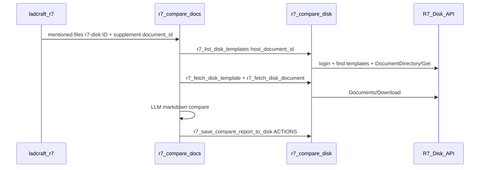

# Архитектура r7-compare-docs

Агент сравнения R7: логика «Сравнение 27», transport через Р7-Диск вместо VFS snapshot.

## Поток

## Отличие от Сравнение 27

| | Сравнение 27 | r7-compare-docs |
|---|--------------|-----------------|
| Шаблоны A | `/workspace/Templates/` bash ls | `r7_list_disk_templates` |
| Документ B | VFS snapshot JSON bash head | `r7_fetch_disk_document` |
| DOCX на ПК | `r7-docx-render` + `r7-export-compare-s27` | **нет** (только на диск) |
| DOCX на диск | `r7-save-compare-disk-s27` (minimal) | `r7-docx-render-s27` + `r7-save-compare-disk-s27` (таблицы Word) |

## Клиент (минимум)

- **Install:** `R7_DISK_BASE_URL`, `R7_DISK_LOGIN`, `R7_DISK_PASSWORD`
- **Плагин:** supplement `document_id` + `file_name` (без id папки templates)
- **Пользователь:** папка `templates` в «Мои документы»
- **Навыки:** авто-поиск templates, find/create `CompareResults` (skillStorage cache)
- **VFS:** не требуется; для VFS-агентов (compare-r7) — отдельный профиль плагина **и** VFS-навыки в составе агента

## Навыки агента (4)

1. `r7-compare-disk` — transport (monolith, без `r7-disk-api`)
2. `r7-docx-render-s27` — markdown/CompareReport → DOCX с таблицами
3. `r7-report-actions-s27` — insert / download md
4. `r7-save-compare-disk-s27` — save docx на диск (локальная копия v1.2.1)
