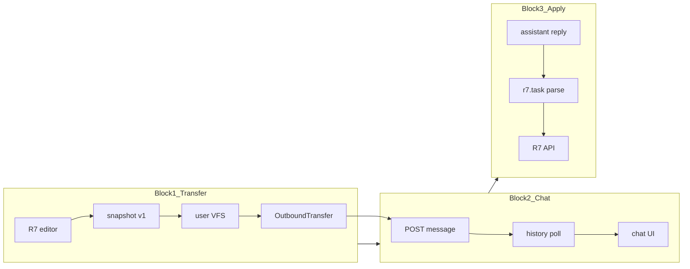

# Архитектура ladcraft-r7

## Контракт между блоками

**Блок 1 → 2:** `OutboundTransfer` (`src/transfer/types.ts`)

**Блок 2 → 3:** `InboundAssistant` (будущее) — raw content + tool_calls

## Каталоги

| Блок | Путь | Документация |
|------|------|--------------|
| 1 | `src/transfer/` | [01-transfer-rules.md](01-transfer-rules.md) |
| 2 | `src/main.ts`, `src/ui/`, `src/eai/session.ts` | [02-chat-rules.md](02-chat-rules.md) |
| 3 | `src/apply/` | [03-apply-rules.md](03-apply-rules.md) |

## Правило изоляции

Изменение блока N не должно требовать правок в блоке M ≠ N, кроме стабильного контракта на границе.
